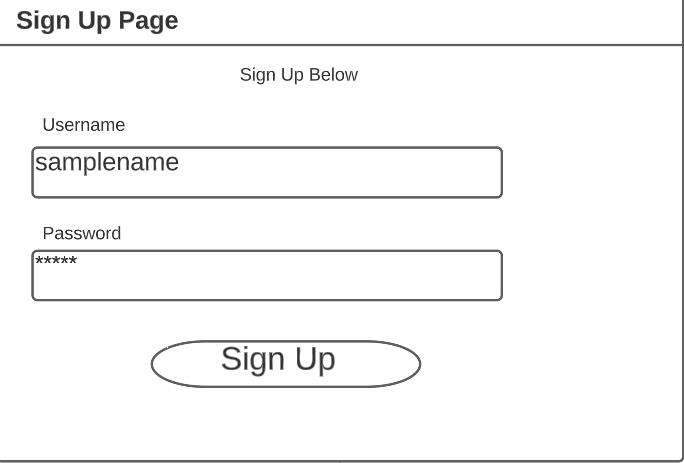
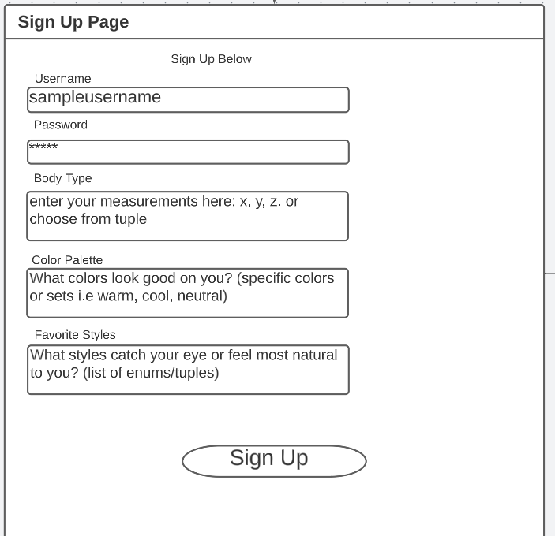
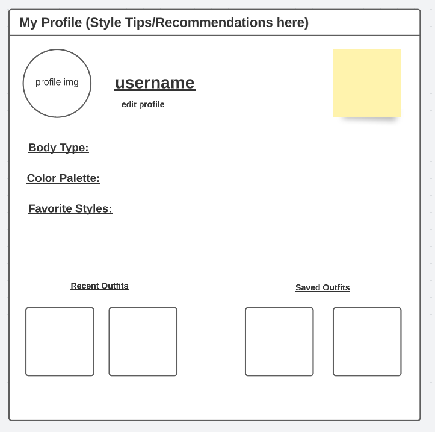
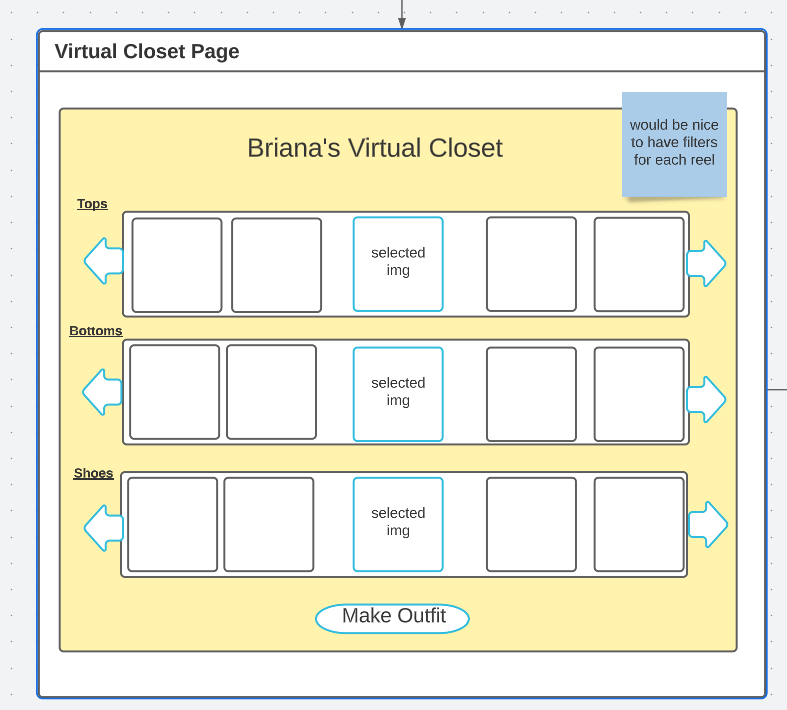
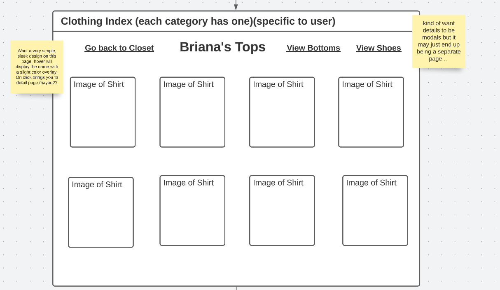
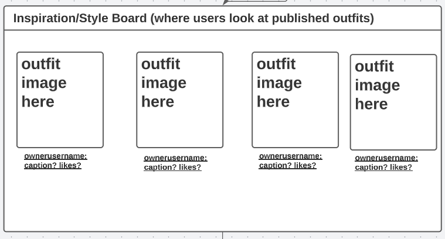
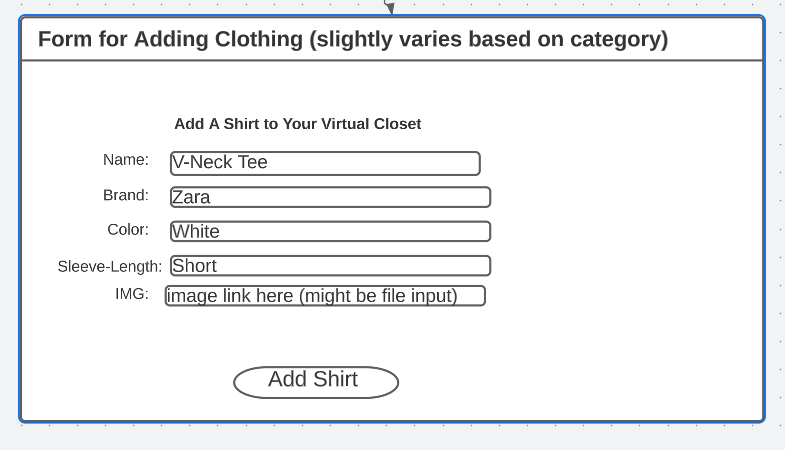
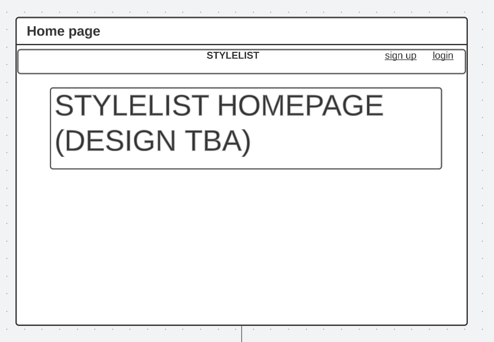
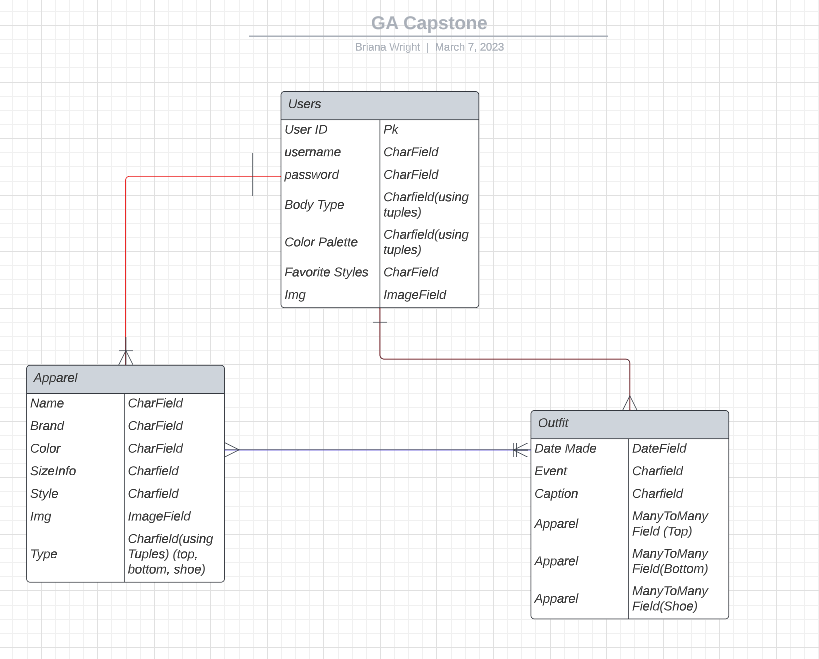

# GA-Final-Project
Briana Wright's Capstone for the General Assembly SEI Immersive Program
# StyleList 

# Overview
- picture of landing page will be here upon completion 

StyleList is an app for users who simply want to organize their closet, elevate their personal style or just love interacting with fashion. As someone who loves fashion and has a high volume of clothing varying in style, I often find that it is hard to keep track of all my clothes. This web application solves this problem and so much more! Want to find new inspiration for an upcoming date? Want to dress in a way that flatters your body type? StyleList has it all!

This app was made using the Python-Django stack. For more information about this project, check out the rest of this repository!  

# User Stories 
My target audience is really anyone, but I do believe that people who love/enjoy fashion will have the most fun with app. 

All users should be able to: 
- Make a personal profile that features the user's name, body type, color-palette and main/fave/inspo styles
- Have access to their virtual closet page
- Be able to add, edit and delete tops, bottoms, and shoes from their closets (maybe accessories(jewelry, hats), jackets, etc outside of MVP...)
- Make/plan outfits they can access in the outfit page (consists of one top, one bottom, one shoe) 
- Have the ability to share their outfits to inspire others! (pinterest kind of feel)
- Be able to save other people's outfits to their "Style Board" (Stretch maybe?)

# Wireframes 

### Log In 

### Sign Up 

### Profile Page

### Virtual Closet

### Clothing Index

### Style Board 

### Clothing Form

### Homepage 

# ERDs (Entity Relationship Diagrams)

# Technologies Used 

- Python 
- Django
- PostgreSQL
- HTML
- CSS 
- Bootstrap/SASS

# Installation Instructions
TBA

# General Approach 
For this project, I planned on adding a lot of interactive features to make this a really fun site to use. To stay as organized as possible I displayed the most functional pieces of the site through user stories and then translated them into ERDs. Since I am using a relational database like PostgreSQL, I wanted to be as meticulous as I can and spent a big chunk of planning time on making sure my ERDs make sense for the functionalities I want in my site. 

My wireframes came last, as styling is typically something I like to leave last and can always be changed. The main prority in planning this project was to have an exceptional, reliable backend. At the current moment I'm not sure if I want a minimalist look for the site or something that is more fun. I do really want users to be able to customize their closet page so it feels more personal, but that is on the bottom of the priority list at the moment. 

# Major Hurdles 